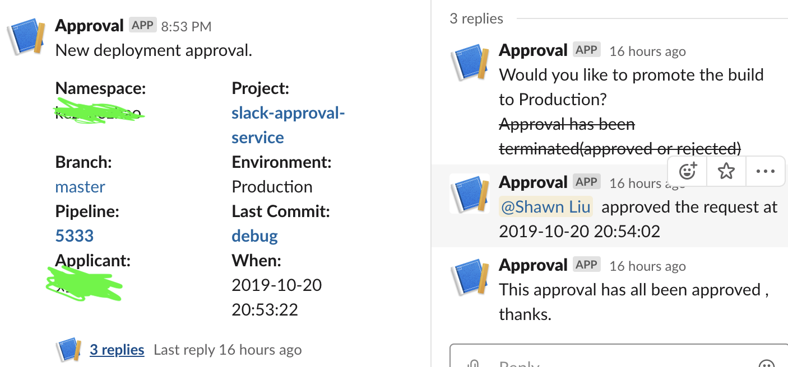

# slack-approval-applicant
application script for slack approval

## How to use  
Use with [Gitlab CI/CD](https://docs.gitlab.com/ee/ci/) and [slack approval citedal](https://github.com/shawnliujw/slack-approval-citadel)
1. deploy the `slack-approval` and get domain , like `http://slack.example.com`  
2. use the check in your gitlab-ci:  
* Now the slack-approval-checker image integrate kubectl already
```yaml
deploy_prod:
  image: registry.cn-shanghai.aliyuncs.com/shawn_repo/slack-approval-guard
  stage: sample
  script:
    - guard setup $CI_PROJECT_NAME -n $CI_PROJECT_NAMESPACE -e $CI_ENVIRONMENT_NAME -P $CI_PROJECT_URL -p $CI_PIPELINE_ID -b $CI_COMMIT_REF_NAME -a $GITLAB_USER_NAME -c $CI_COMMIT_TITLE -C $CI_COMMIT_SHA -s 'http://slack.example.com/approval'
    - if [ $N -ne 0 ];  then exit ; fi
    - [your other scripts]
```

## workflow  
1. registry approval with the command above, then the pipeline will show message like below:  

2. then in the configured slack channel, you will see message like below:  
  

3. when the assignee click the button, slack will work like below:  


4. meanwhile you receive message from step 3, the pipeline will also show message like below:  
* Approved  
  

* Rejected  

